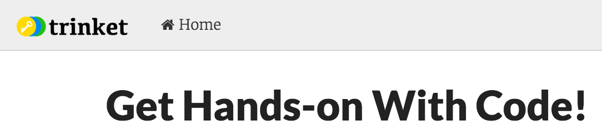
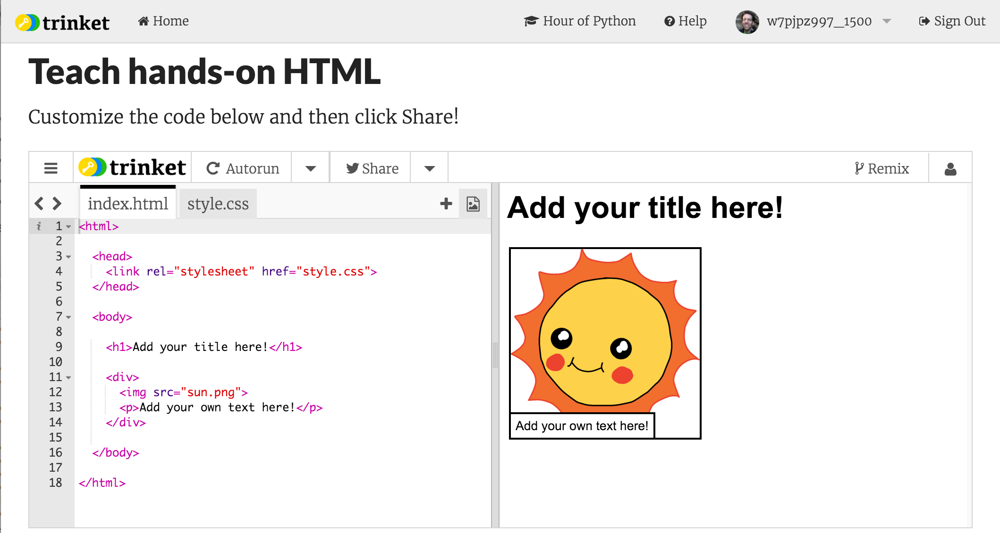
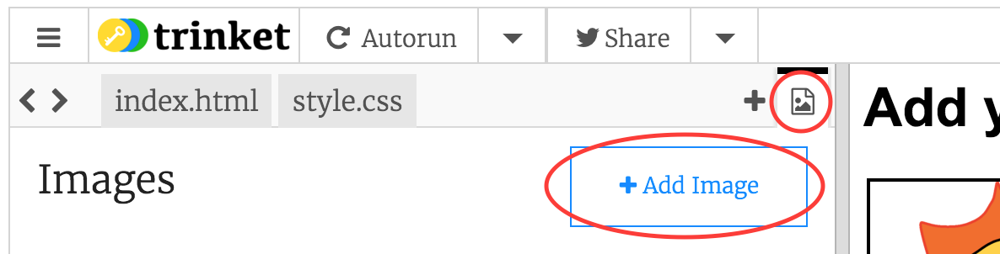

---
title: Tell a Minecraft Story
level: HTML & CSS 1
language: en-GB
embeds: "*.png"
materials: ["Club Leader Resources/*.*","Project Resources/*.*"]
stylesheet: web
...

# Introduction { .intro}

In this project, you'll learn how to create your own webpage to tell a story about Minecraft.


# Step 1: Decide on a story { .activity}

Before you get coding, you'll need to decide on a story to tell.

## Activity Checklist { .check}

+ Think about the story you want to tell. It could be:
	+ How you built something;
	+ What happened in your Minecraft world;
	+ A tour around your finished building.

# Step 2: Log in to Trinket { .activity}

Now you know what story you're going to tell, you need to log in to Trinket so you can bring in images from Minecraft.

## Activity Checklist { .check}

+ Follow the FJS Code Club HTML Login Instructions
	+ You should end up on the Trinket Welcome page

	

# Step 3: Editing your story { .activity}

Let's continue by editing the HTML content and CSS style of the story webpage.

## Activity Checklist { .check}

+ Click on this trinket link to start: <a href="http://jumpto.cc/web-story" target="_blank">jumpto.cc/web-story</a> -- you should end up with another window containing the Trinket shown below:



+ Webpage content goes in the `<body>` of the HTML document.

	Go to line 7 of the code, and you should see the webpage content, which is inside `<body>` and `</body>` tags.

	

+ Can you tell which tags are used to create the different parts of the webpage?

	

	+ `<h1>` is a __heading__. You can use the numbers 1 to 6 to create headings of different sizes;
	+ `<div>` is short for __division__, and is a way of grouping stuff together. In this webpage, you'll use it to group together all the stuff for each part of your story;
	+ `` is an __image__;
	+ `<p>` is a __paragraph__ of text.

##Challenge: Make some changes {.challenge}
Edit the HTML and the CSS code to customise your webpage.


You can alter the colours used in the webpage, and you can also use fonts like <span style="font-family: Arial;">Arial</span>, <span style="font-family: Comic Sans MS;">Comic Sans MS</span>, <span style="font-family: Impact;">Impact</span> and <span style="font-family: Tahoma;">Tahoma</span>.

If you need more help, you can use the <a href="https://www.codeclubprojects.org/en-GB/webdev/happy-birthday/">Happy Birthday</a> project to help you.

## Save Your Project {.save .check}

+ To save your project, just click on the Remix button at the top right of your trinket
	+ The button should change to show a Save button and a slider that lets you switch back to the original version
	+ Click the Save button to save your changes in the future

# Step 4: Telling your story { .activity}

Let's add a second part to your story.

## Activity Checklist { .check}

+ Go to line 17 of the code, and add in another set of `<div>` and `</div>` start and end tags. This will create a new box for the next part of your story.

	

+ Add a paragraph of text inside your new `<div>` tag.

	

+ Finally, you can add an image to your new box, by adding this code inside your `<div>` tag:

	```
	
	```

	Notice that `` tags are a bit different to other tags, as they don't have an end tag.

+ For HTML images, you need to add the __source__ of the image, inside the speech marks. Let's find an image to add to your story.

	Go to <a href="http://jumpto.cc/web-images" target="_blank">jumpto.cc/web-images</a>, and find an image that you want to include in your story.

+ Right-click the image, and click 'Copy image URL'. The URL is the address of the image.

	

+ Paste the URL between the speech marks in your `` tag. You should see your image appear!

	

+ You can also upload your own images to your webpage! To do this, first click the image icon at the top of your trinket -- you will see a list of built-in images you can add to this project

	

+ Click the Add Image button to see a list of any images you have uploaded so far -- click the Upload button to add a new one

	

+ Find your image on your computer, and drag it into your trinket.

	

+ You can then just add the name of your new image between the speech marks in your `` tag, like this:

	```
	
	```

+ To grab a screenshot from Minecraft, press F2. You can take a screenshot without the toolbox and your arm by pressing F1 first (and bring the toolbox back by pressing F1 again afterwards).
	+ The screenshot will be saved in `%appdata%\.minecraft/screenshots`
	+ Try pressing F5 to get a different perspective!

## Save Your Project {.save}

##Challenge: Keep going! {.challenge}
Use what you've learnt in this project to finish telling your story! Here's an example:


## Save Your Project {.save}